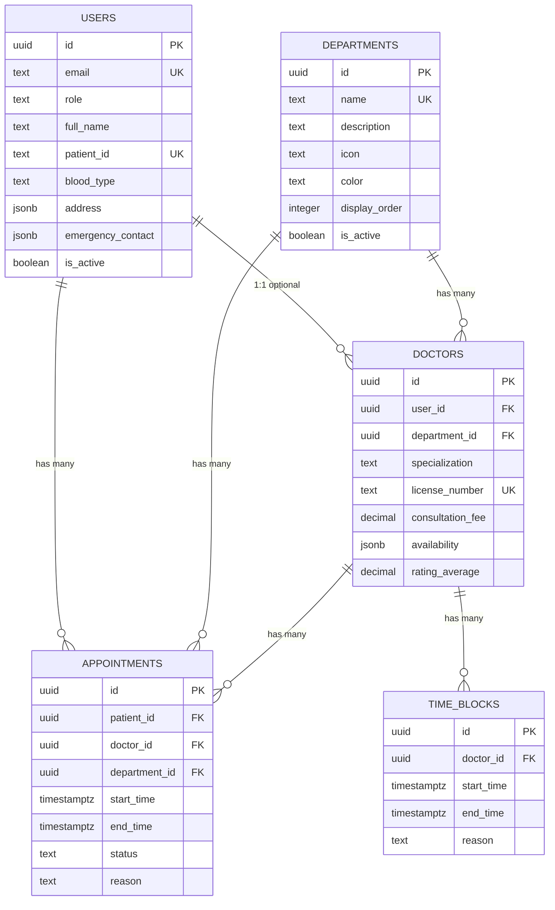

# HealthBook Database Schema Documentation

## Overview
HealthBook uses **Supabase** (PostgreSQL) as the database backend with Row Level Security (RLS) for data protection.

---

## Entity Relationship Diagram



---

## Tables Summary

| Table | Purpose | Key Features |
|-------|---------|--------------|
| `users` | All user profiles | Auto patient ID, blood type validation |
| `departments` | Medical departments | Display order, active filtering |
| `doctors` | Doctor profiles | Availability JSON, ratings |
| `appointments` | Bookings | Double-booking prevention, status tracking |
| `time_blocks` | Doctor unavailability | Conflict checking |

---

## RLS Policy Summary

### Users Table
| Policy | Operation | Rule |
|--------|-----------|------|
| Own profile access | SELECT/UPDATE | `auth.uid() = id` |
| Admin access | ALL | User role = 'admin' |

### Departments Table
| Policy | Operation | Rule |
|--------|-----------|------|
| Public read | SELECT | `is_active = TRUE` |
| Admin manage | ALL | User role = 'admin' |

### Doctors Table
| Policy | Operation | Rule |
|--------|-----------|------|
| Public read | SELECT | `is_active = TRUE` |
| Self update | UPDATE | `auth.uid() = user_id` |
| Admin manage | ALL | User role = 'admin' |

### Appointments Table
| Policy | Operation | Rule |
|--------|-----------|------|
| Patient access | SELECT/INSERT/UPDATE | `auth.uid() = patient_id` |
| Doctor access | SELECT/UPDATE | Doctor's user_id = auth.uid() |
| Admin manage | ALL | User role = 'admin' |

### Time Blocks Table
| Policy | Operation | Rule |
|--------|-----------|------|
| Public read | SELECT | Always true (needed for availability) |
| Doctor manage | ALL | Doctor's user_id = auth.uid() |
| Admin manage | ALL | User role = 'admin' |

---

## Key Database Functions

| Function | Trigger | Purpose |
|----------|---------|---------|
| `generate_patient_id()` | BEFORE INSERT on users | Auto-generates PT-YYYY-XXXX |
| `check_appointment_overlap()` | BEFORE INSERT/UPDATE on appointments | Prevents double booking |
| `check_time_block_conflict()` | BEFORE INSERT/UPDATE on appointments | Blocks during unavailable times |
| `update_appointment_status_timestamps()` | BEFORE UPDATE on appointments | Auto-sets confirmed_at, cancelled_at, etc. |
| `sync_doctor_role()` | AFTER INSERT on doctors | Sets user role to 'doctor' |

---

## Setup Instructions

### 1. Create Supabase Project
1. Go to [supabase.com](https://supabase.com)
2. Create a new project
3. Note your **Project URL** and **anon key**

### 2. Run Migrations
Execute these files in order in the **SQL Editor**:
1. `001_initial_schema.sql` - Tables and base triggers
2. `002_rls_policies.sql` - Security policies
3. `003_indexes.sql` - Performance indexes
4. `004_functions_triggers.sql` - Helper functions
5. `005_seed_data.sql` - Initial data

### 3. Verify Setup
```sql
-- Check tables
SELECT table_name FROM information_schema.tables 
WHERE table_schema = 'public';

-- Check RLS enabled
SELECT tablename, rowsecurity FROM pg_tables 
WHERE schemaname = 'public';

-- Check seed data
SELECT COUNT(*) as departments FROM public.departments;
SELECT COUNT(*) as users FROM public.users;
SELECT COUNT(*) as doctors FROM public.doctors;
```

---

## Testing Checklist

### RLS Policy Tests
- [ ] Patient can only see their own appointments
- [ ] Patient cannot see other patients' data
- [ ] Admin can see all appointments
- [ ] Doctor can see their assigned appointments
- [ ] Unauthenticated users cannot access any data

### Constraint Tests
- [ ] Cannot create appointment with end_time before start_time
- [ ] Cannot double-book a doctor
- [ ] Patient ID is auto-generated and unique
- [ ] Blood type validation works

### Performance Tests
- [ ] Query appointments by patient_id < 50ms
- [ ] Query appointments by doctor_id < 50ms
- [ ] Department listing < 10ms
- [ ] Doctor listing with department filter < 30ms
