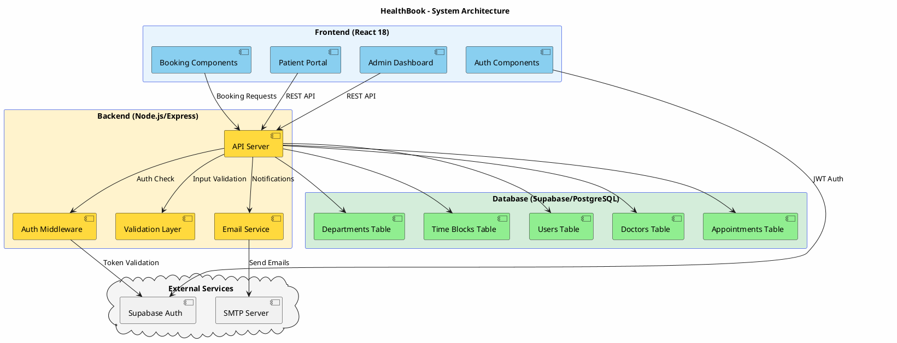
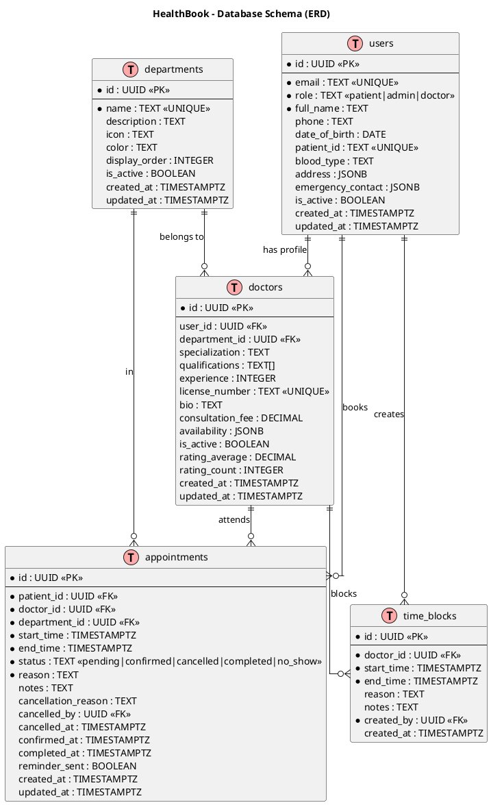
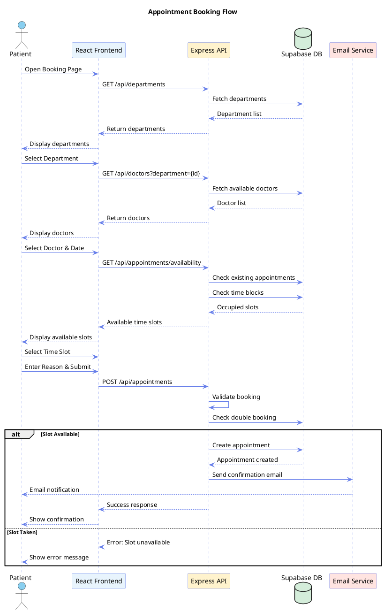
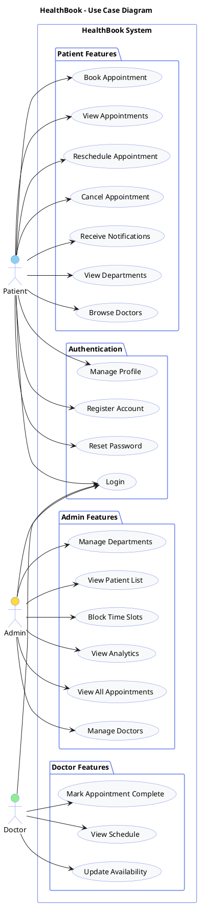
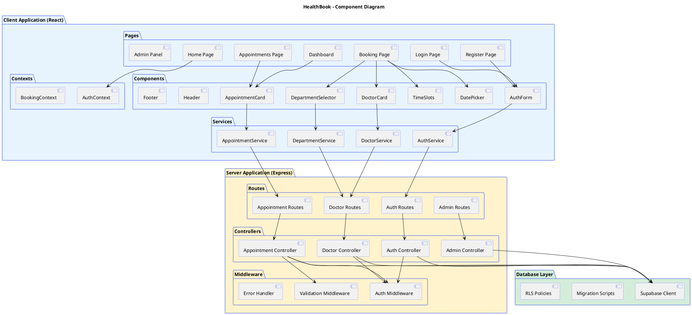
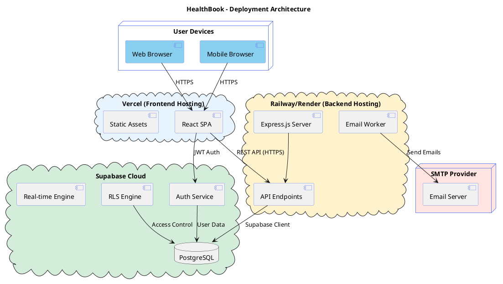
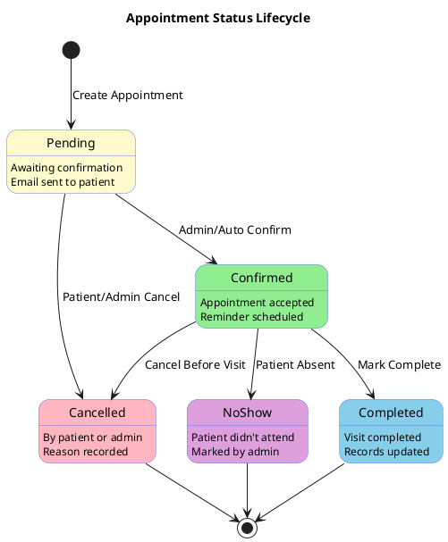
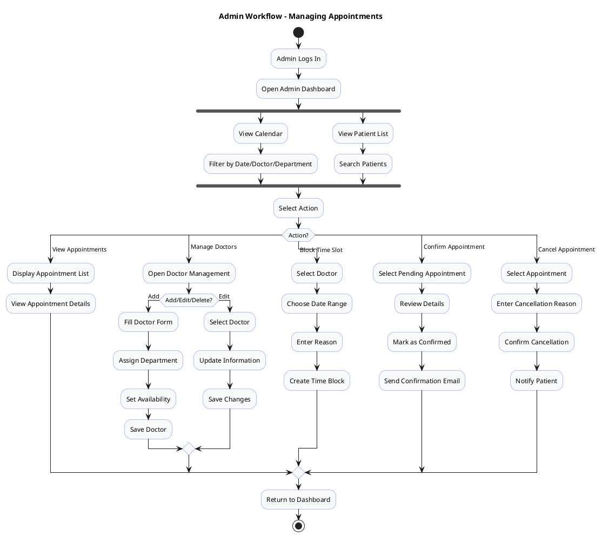
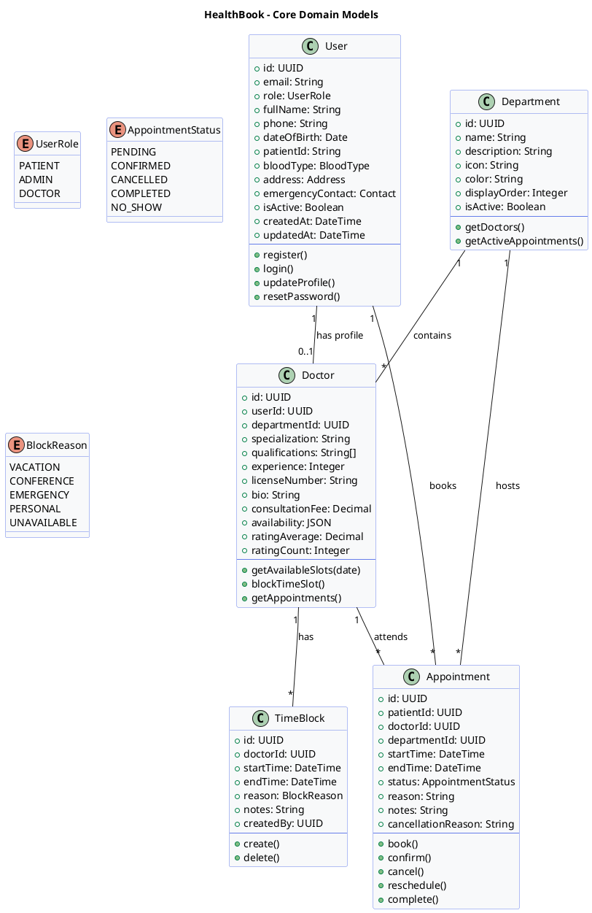
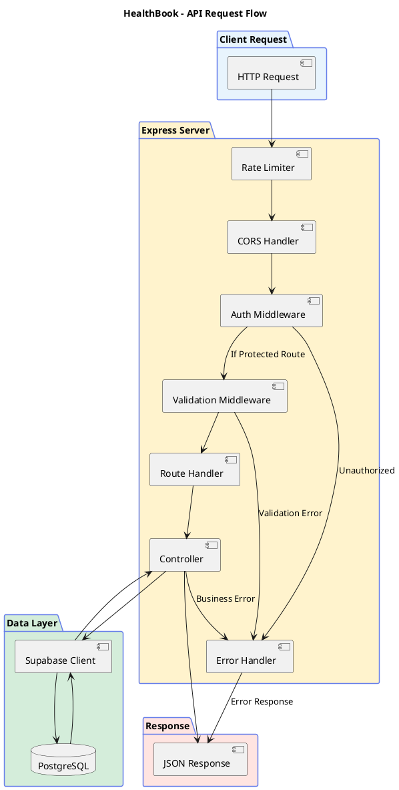

# HealthBook - PlantUML Diagrams for PPT

## 1. System Architecture Diagram

---

## 2. Database Entity Relationship Diagram (ERD)

---

## 3. User Flow - Appointment Booking Sequence Diagram

---

## 4. Use Case Diagram

---

## 5. Component Diagram

---

## 6. Deployment Diagram

---

## 7. State Diagram - Appointment Lifecycle

---

## 8. Activity Diagram - Admin Workflow

---

## 9. Class Diagram - Core Models

---

## 10. API Flow Diagram

---

## How to Use These Diagrams

1. **Copy the PlantUML code** between the \`\`\`plantuml tags
2. **Generate images** using:
   - [PlantUML Online Server](https://www.plantuml.com/plantuml/uml/)
   - [PlantText](https://www.planttext.com/)
   - VS Code PlantUML Extension
   - IntelliJ IDEA PlantUML Plugin
3. **Export as PNG/SVG** for your PowerPoint presentation

## Recommended Diagrams for PPT

| Slide Purpose | Recommended Diagram |
|---------------|---------------------|
| System Overview | #1 System Architecture |
| Database Design | #2 ERD Diagram |
| User Journey | #3 Sequence Diagram |
| Features Overview | #4 Use Case Diagram |
| Technical Stack | #5 Component Diagram |
| Deployment Plan | #6 Deployment Diagram |
| Business Logic | #7 State Diagram |
| Admin Features | #8 Activity Diagram |
